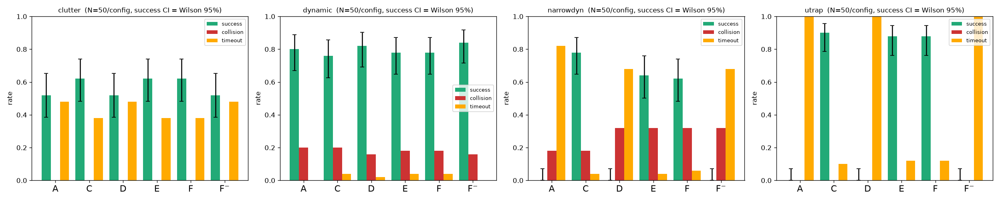
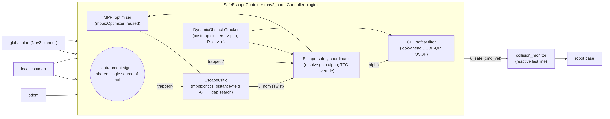
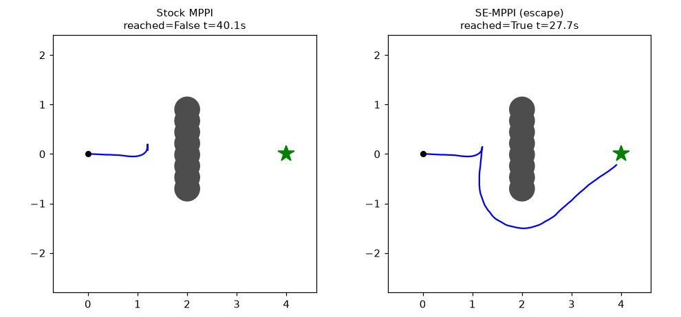
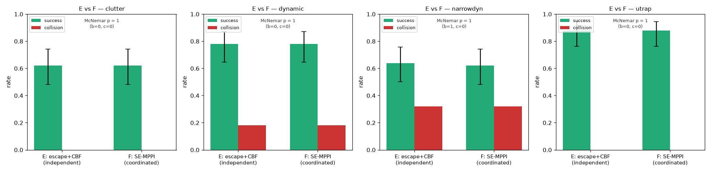

# SE-MPPI

**A Nav2-native local controller that unifies online local-minima escape with a
control-barrier-function safety filter — coordinated so that an escape maneuver
stays certified-safe.**

Jung Mo Kang · [kangjmo91@gmail.com](mailto:kangjmo91@gmail.com)

[](https://docs.ros.org/en/jazzy/)
[](https://docs.nav2.org/)
[](LICENSE)
[-6f42c1)](docs/papers/latex/main.pdf)
[](https://github.com/sponsors/kjungmo)

<p align="center">
  
</p>

<p align="center"><em>Randomized 1,200-trial 2D benchmark (Wilson 95% error bars on success,
N = 50 per cell). On the trap families the detect-and-switch escape configs (C, E, F)
separate cleanly from stock (A), CBF-only (D), and no-gap (F⁻), which time out at 0% success.</em></p>

---

## Menu

- [Overview](#overview)
- [System architecture](#system-architecture)
- [Features](#features)
- [Requirements](#requirements)
- [Install and build](#install-and-build)
- [Quick start](#quick-start)
- [Benchmark artifacts](#benchmark-artifacts)
- [Evaluation gallery](#evaluation-gallery)
- [Paper and citation](#paper-and-citation)
- [Documentation](#documentation)
- [Acknowledgements](#acknowledgements)
- [Sponsor](#-sponsor)
- [License](#license)

## Overview

The MPPI controller shipped with ROS 2 Nav2 is among the strongest deployable
local controllers for mobile robots, yet in narrow, crowded, dynamic spaces it
is prone to local-minima entrapment and enforces collision avoidance only
through soft costs, with no formal safety guarantee. **SE-MPPI** is a single
Nav2-native controller that unifies online local-minima detection-and-escape
with a dynamic-obstacle control-barrier-function (CBF) safety filter, reconciled
by a coordinator that modulates the barrier's class-𝒦 gain on detected
entrapment; forward invariance is preserved for any positive gain, so an escape
maneuver admitted by a raised gain stays certified-safe. This repository is the
open code, data, and manuscript accompanying a **preprint**.

We are deliberate about what is measured and what is not. In a randomized
1,200-trial 2D benchmark that mirrors the controller math one-to-one, the
**detection-and-escape layer is the decisive contribution** — success rises from
**0% to 88–90%** on the static U-trap family and from **0% to 62–78%** on the
narrow-dynamic family, with the free-space gap search load-bearing. The
**escape–safety coordination is a certified-safe mechanism, not an empirical
gain**: in the regime we could test it is statistically indistinguishable from an
independent escape+CBF stack (McNemar p = 1 in every family), and we report that
null openly rather than hide it.

## System architecture

<p align="center">
  
</p>

The `SafeEscapeController` subclasses the stock MPPI controller and post-processes
its nominal command each cycle. A **shared entrapment signal** (derived from
furthest-reached global-path progress) drives both the sampling-time
`EscapeCritic` and the output-time escape–safety coordinator; the coordinator
resolves the CBF gain α (with a time-to-collision override), and the CBF safety
filter — fed by the `DynamicObstacleTracker` — projects the command onto the
CBF-safe set via a small QP before it reaches `cmd_vel`, which Nav2's
`collision_monitor` guards as a final reactive layer. The escape and safety
layers thus act at complementary points, unified by one entrapment signal and the
coordinated gain.

## Features

1. **Nav2-native controller plugin.** `SafeEscapeController` ships as a
   `nav2_core::Controller` plus a pluginlib MPPI critic (`EscapeCritic` in the
   `mppi::critics` namespace), reusing the stock MPPI optimizer for the nominal
   command.
2. **Detect-and-switch local-minima escape.** Entrapment is declared when the
   furthest-reached path index stalls; the `EscapeCritic` then injects
   distance-field APF and free-space gap-attraction costs **only while trapped**,
   so free-space behavior is unchanged.
3. **Look-ahead-point CBF safety filter (OSQP).** A per-cycle discrete CBF-QP on
   tracked dynamic obstacles projects the nominal `(v, ω)` onto the safe set; on
   an infeasible or relaxed barrier it brakes forward velocity rather than
   driving into an imminent collision.
4. **Escape–safety coordination.** The coordinator modulates the CBF class-𝒦
   gain on detected entrapment (α_base → α_escape) with a TTC override, so the
   robot escapes without losing forward invariance — proven for any positive,
   bounded gain schedule (see the paper's certified-safe-escape proposition).
5. **82 C++ unit tests across 13 files** (gtest) plus linters, covering the
   entrapment detector, CBF filter, coordinator, tracker, gap search, repulsion,
   path progress, and plugin loading.
6. **Committed benchmark artifacts.** The 1,200-trial randomized 2D benchmark
   ships its raw per-trial CSV, summary, statistics, tables, and figures; a
   number guard (`scripts/check_paper_numbers.py`) asserts that every headline
   figure quoted in the paper traces to a committed artifact.
7. **Gazebo U-trap testbed + live Nav2 integration.** A committed testbed
   (`experiments/se_mppi_utrap/`) and a one-command sim launcher run the
   controller inside a live ROS 2 Jazzy + Nav2 + Gazebo Harmonic stack.

## Requirements

Installed reproducibly via **RoboStack** (conda-forge + `robostack-jazzy`), so the
build does not depend on the host OS version (validated on Ubuntu 20.04 with an
NVIDIA GPU). The setup script (`scripts/setup_ros2_env.sh`) provisions:

- **ROS 2 Jazzy** (`ros-jazzy-ros-base`)
- **Nav2** — `navigation2`, `nav2-bringup`, `nav2-mppi-controller`,
  `nav2-minimal-tb3-sim`, `nav2-simple-commander`
- **Gazebo Harmonic** + `ros-gz`, and **RViz 2** (for the live sim)
- **OSQP** — `osqp-eigen`, `eigen` (the CBF-QP)
- **Toolchain** — `colcon-common-extensions`, `cxx-compiler`, `cmake`, `ninja`,
  `pkg-config`

A GPU workstation is recommended: the live Gazebo stack needs hardware rendering.
See [`RUN.md`](RUN.md) for the full run guide and troubleshooting.

## Install and build

```bash
git clone https://github.com/kjungmo/se-mppi-nav2.git && cd se-mppi-nav2
bash scripts/setup_ros2_env.sh
```

Activate the environment, then build and test (from
[`HANDOFF.md`](HANDOFF.md) §2):

```bash
export MAMBA_ROOT_PREFIX=$HOME/micromamba
eval "$($HOME/.local/bin/micromamba shell hook -s bash)"
micromamba activate ros2

colcon build --packages-select nav2_se_controller
colcon test --packages-select nav2_se_controller && colcon test-result --verbose
```

> The `setup_ros2_env.sh` script prints the exact activation commands for your
> environment on exit (root/container prefixes differ from the local non-root
> prefix shown above).

## Quick start

**Run the controller in a live Gazebo + Nav2 stack** (one command; builds if
needed, launches Gazebo + Nav2 + RViz):

```bash
bash scripts/run_sim.sh                 # GUI sim + RViz, you click the goal
bash scripts/run_sim.sh --drive         # + auto initial pose & goal (smoke)
bash scripts/run_sim.sh --headless      # no GUI (CI / remote)
```

**Register the plugin in your own Nav2 stack** by setting the
`controller_server`'s `FollowPath` plugin to
`nav2_se_controller::SafeEscapeController` and merging the `se_*` keys and the
`EscapeCritic` entry from the fully-commented sample parameter file:
[`src/nav2_se_controller/config/nav2_se_controller_params.yaml`](src/nav2_se_controller/config/nav2_se_controller_params.yaml).

**Validate the mechanisms without a simulator** (pure-Python 2D; generates the
mechanism figures):

```bash
cd experiments/prototype && python3 run_validation.py
```

## Benchmark artifacts

The controlled quantitative comparison is a **randomized 2D benchmark that
mirrors the controller math one-to-one** — it reuses the exact primitives
validated in the mechanism study (the same MPPI sampler, distance-field APF, gap
raycast, look-ahead CBF-QP via OSQP, α coordination with TTC override, and
monotone-progress entrapment detector) across seed-deterministic randomized
scenarios, so that success, collision, and clearance carry confidence intervals
and paired significance tests. It is **not** the live Nav2 controller; a
full-scale 3D physics benchmark (BARN / DynaBARN / HuNavSim against the deployable
baselines) is specified but deferred to future work.

**Regenerate** (from
[`docs/papers/2026_2d-benchmark-results.md`](docs/papers/2026_2d-benchmark-results.md);
the committed data uses `N=50`):

```bash
export MAMBA_ROOT_PREFIX=$HOME/micromamba
micromamba run -n ros2 python3 -m experiments.benchmark2d.runner \
    --families utrap clutter dynamic narrowdyn -n <N> --workers 6 --max-steps 400
micromamba run -n ros2 python3 -m experiments.benchmark2d.report      # tables + stats
micromamba run -n ros2 python3 -c "from experiments.benchmark2d import figures, aggregate; \
    r=aggregate.aggregate('experiments/results_2d/trials.csv','experiments/results_2d'); \
    figures.plot_all(r['summary'], r['stats'], 'experiments/results_2d/figures')"
```

**Success rate, % (Wilson 95% CI), N = 50 per cell** — condensed from
[`experiments/results_2d/tables.md`](experiments/results_2d/tables.md)
(4 families × 50 seeds × 6 configs = 1,200 paired trials):

| Config | U-trap | Clutter | Dynamic | Narrow-dyn |
|---|---|---|---|---|
| A · stock            | 0 [0, 7]    | 52 [39, 65] | 80 [67, 89] | 0 [0, 7]    |
| C · escape           | 90 [79, 96] | 62 [48, 74] | 76 [63, 86] | 78 [65, 87] |
| D · CBF              | 0 [0, 7]    | 52 [39, 65] | 82 [69, 90] | 0 [0, 7]    |
| E · escape+CBF (indep.) | 88 [76, 94] | 62 [48, 74] | 78 [65, 87] | 64 [50, 76] |
| **F · SE-MPPI (coord.)** | **88 [76, 94]** | **62 [48, 74]** | **78 [65, 87]** | **62 [48, 74]** |
| F⁻ · no-gap          | 0 [0, 7]    | 52 [39, 65] | 84 [71, 92] | 0 [0, 7]    |

The escape layer is decisive on both trap families and survives Holm correction
(U-trap 0% → 88–90%, adjusted p = 1.4×10⁻⁹; narrow-dynamic 0% → 62–78%,
adjusted p = 1.1×10⁻⁶), and F⁻ collapsing to 0% shows the free-space gap subgoal
is load-bearing. The **key E-vs-F contrast (independent vs. coordinated α) is
null in every family** (McNemar p = 1): in this benchmark the coordination
produces no measurable outcome difference over independent escape+CBF, which we
report as an honest null and delimit where coordination should matter.

## Evaluation gallery

| U-trap escape (mechanism) | Escape–safety coordination | Coordination contrast E vs. F |
|---|---|---|
|  |  |  |
| Stock MPPI stalls at the trap mouth while SE-MPPI detects the stall and rounds the U-shaped obstacle via the gap-attraction subgoal. | During the escape phase the coordinated gain rises α: 2 → 6 while the QP slack stays ≈ 0 throughout — the escape maneuver is admitted yet remains certified-safe (h ≥ 0). | The independent (E) and coordinated (F) stacks are statistically indistinguishable in every family (McNemar p = 1) — the honest null result. |

## Paper and citation

The manuscript is a preprint: **"Safe-Escape MPPI: Coordinating Online
Local-Minima Escape with Control-Barrier-Function Safety in a Nav2-Native
Controller."** Read it here: [`docs/papers/latex/main.pdf`](docs/papers/latex/main.pdf)
(LaTeX source: [`docs/papers/latex/main.tex`](docs/papers/latex/main.tex)).

If you use SE-MPPI in your research, please cite:

```bibtex
@misc{kang2026semppi,
  title  = {Safe-Escape MPPI: Coordinating Online Local-Minima Escape with
            Control-Barrier-Function Safety in a Nav2-Native Controller},
  author = {Kang, Jung Mo},
  year   = {2026},
  note   = {Preprint. Manuscript and artifacts at
            https://github.com/kjungmo/se-mppi-nav2},
  howpublished = {\url{https://github.com/kjungmo/se-mppi-nav2}}
}
```

Machine-readable metadata is in [`CITATION.cff`](CITATION.cff).

## Documentation

| Document | Contents |
|---|---|
| [`docs/papers/latex/main.pdf`](docs/papers/latex/main.pdf) | The preprint (PDF). |
| [`docs/papers/2026_2d-benchmark-results.md`](docs/papers/2026_2d-benchmark-results.md) | Randomized 2D benchmark write-up (methodology, tables, interpretation). |
| [`docs/papers/references.bib`](docs/papers/references.bib) · [`docs/papers/reference-verification-report.md`](docs/papers/reference-verification-report.md) | Verified bibliography and its verification report. |
| [`docs/architecture/2026-06_safe-escape-mppi-design.md`](docs/architecture/2026-06_safe-escape-mppi-design.md) | Controller architecture and module design. |
| [`docs/architecture/2026-06_se-mppi-evaluation-protocol.md`](docs/architecture/2026-06_se-mppi-evaluation-protocol.md) | Evaluation protocol, metrics, and ablation definitions. |
| [`docs/research/2026-06_safe-escape-mppi-problem-statement.md`](docs/research/2026-06_safe-escape-mppi-problem-statement.md) · [`docs/research/2026-06_se-mppi-novelty-verification.md`](docs/research/2026-06_se-mppi-novelty-verification.md) | Problem statement / prior work and the novelty verification. |
| [`experiments/README.md`](experiments/README.md) · [`experiments/runner/README.md`](experiments/runner/README.md) | Evaluation layout and the turnkey harness. |
| [`src/nav2_se_controller/config/nav2_se_controller_params.yaml`](src/nav2_se_controller/config/nav2_se_controller_params.yaml) | Fully-commented sample parameter set. |
| [`RUN.md`](RUN.md) | Local-machine run guide (Gazebo sim → real robot) with troubleshooting. |
| [`HANDOFF.md`](HANDOFF.md) | Korean development handoff (build/test cheat-sheet, status, next milestones). |

## Acknowledgements

SE-MPPI builds directly on the [ROS 2 Nav2](https://docs.nav2.org/) stack and its
`nav2_mppi_controller`, whose critic-plugin interface makes an entrapment-aware
escape critic possible without forking the optimizer. The CBF-QP is solved with
[OSQP](https://osqp.org/) via `osqp-eigen`, and the build is provisioned by
[RoboStack](https://robostack.github.io/).

## 💛 Sponsor

If SE-MPPI saves you time, consider
[sponsoring](https://github.com/sponsors/kjungmo). Sponsorship funds
maintenance, new features, and faster issue response. Backers will be
acknowledged here — thank you.

## License

Licensed under the Apache License, Version 2.0 — see [`LICENSE`](LICENSE).
