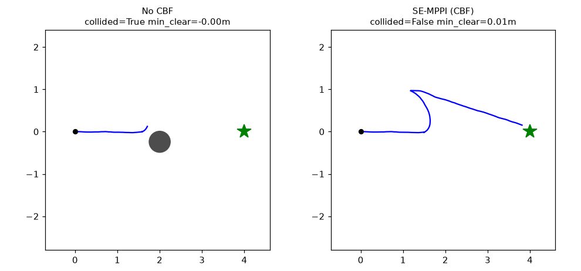
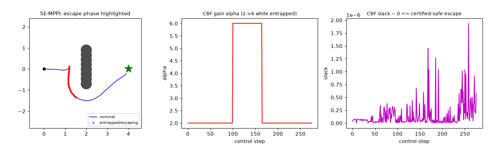

# Safe-Escape MPPI: Coordinating Online Local-Minima Escape with Control-Barrier-Function Safety in a Nav2-Native Controller

> ## SUPERSEDED — the current manuscript is `docs/papers/latex/main.tex`
>
> **This file is a historical working draft (2026-06-10), kept for the
> record. The current, complete version is `docs/papers/latex/main.tex`
> (compiled: `docs/papers/latex/main.pdf`).** Two things below are stale in
> particular: (1) the Sec. VI-C cells marked *pending* **have since been
> measured** — the randomized 1,200-trial 2D benchmark is reported in
> `docs/papers/2026_2d-benchmark-results.md` with raw data under
> `experiments/results_2d/`; (2) the "IEEE CASE 2025" venue attribution for
> DRPA-MPPI did not survive reference verification ("submitted to", not
> accepted — see `docs/papers/reference-verification-report.md`). Do not
> cite this file; cite `main.tex`/`main.pdf`.

> **Status:** complete working draft (2026-06-10). Mechanism validation and live
> integration results are measured; the large-scale quantitative benchmark
> (Sec. VI-C) is specified but **not yet run** — those cells are marked *pending*
> and MUST NOT be cited as results until measured.
> **Target venue:** IEEE RA-L (+ ICRA). **Code:** `src/nav2_se_controller` (Apache-2.0).
> **Citation reliability:** external numbers are self-reported / search-derived
> unless marked verified; originals to be re-checked before camera-ready.

---

## Abstract

Sampling-based model predictive control — in particular the Model Predictive
Path Integral (MPPI) controller shipped with ROS 2 Nav2 — is among the strongest
deployable local controllers for mobile robots, yet it has two structural
weaknesses that surface *together* in narrow, crowded, dynamic spaces: (i) a
finite horizon and Gaussian sampling make it prone to **local-minima entrapment**
(U-shaped or symmetric obstacle fields, tight gaps), and (ii) collision avoidance
is enforced only through **soft cost terms with no formal safety guarantee** and
no prediction of moving obstacles. Prior work treats these in isolation: escape
methods augment sampling but provide no safety certificate, while CBF–MPPI methods
add safety but can *worsen* entrapment by pruning the exploratory samples needed to
escape — and none ship as a deployable Nav2 controller. We present **Safe-Escape
MPPI (SE-MPPI)**, a single Nav2-native local controller that unifies online
local-minima **detection-and-escape** (distance-field APF + free-space gap search)
with a dynamic-obstacle **control-barrier-function (CBF) safety filter**,
reconciled by an **escape–safety coordinator** that modulates the barrier's
class-$\mathcal{K}$ gain on detected entrapment. Our key insight is that escape and
safety conflict, and that the conflict is resolvable by coordination rather than by
naively stacking the two layers: forward invariance ($h \geq 0$, collision-free) is
preserved for *any* positive gain, so raising the gain to permit an escape maneuver
keeps that maneuver **certified-safe**. We implement SE-MPPI as a `nav2_core`
controller plugin plus an MPPI critic, validate each mechanism in a standalone 2D
study, and demonstrate that the controller loads, activates, and produces valid
commands inside a full live ROS 2 Jazzy + Nav2 + Gazebo stack. A large-scale
quantitative benchmark (BARN/DynaBARN/HuNavSim) is specified as the remaining step.

---

## I. Introduction

Autonomous mobile robots increasingly operate in cluttered, dynamic indoor
environments — warehouses, hospitals, service floors — where the local controller
must be simultaneously *fast*, *non-conservative*, and *safe*. Within the ROS 2
Nav2 ecosystem, the MPPI controller (`nav2_mppi_controller`) has become the
de-facto high-performance choice: it supports differential, omnidirectional, and
Ackermann robots and runs at 50+ Hz on CPU by sampling `batch_size` rollouts,
scoring them with a bank of critics, and combining them with an
information-theoretic softmax.

Two weaknesses, however, recur exactly in the environments that matter most:

1. **Local-minima entrapment.** A finite prediction horizon (by default
   $56 \times 0.05\,\mathrm{s} \approx 2.8\,\mathrm{s}$) and zero-mean Gaussian
   sampling cause the robot to stall or oscillate in non-convex traps. Nav2's only
   mitigations are *always-on* cost-shaping heuristics (`PreferForwardCritic`,
   `TwirlingCritic`) that neither *detect* entrapment nor guarantee escape.
2. **No formal safety.** Avoidance is encoded as soft costs (`ObstaclesCritic`,
   `CostCritic`); there is no forward-invariance guarantee, and crucially **no
   prediction of dynamic-obstacle motion** — the costmap is a present-time snapshot
   and `collision_monitor` is purely reactive.

These weaknesses interact: being conservative for safety invites entrapment, and
escaping aggressively invites collision. We argue they should be solved *together*,
in one deployable controller. Fig. 2 (Sec. VI-A) illustrates the first weakness and
SE-MPPI's response: stock MPPI stalls in front of a U-shaped trap while SE-MPPI
detects the entrapment and rounds it under the certified-safe coordination of Sec. IV-E.

**Contributions.**
- **C1 (system).** To our knowledge, the first **Nav2-native local controller
  plugin** that combines a CBF safety filter with online local-minima escape;
  packaged as a `nav2_core::Controller` plus a pluginlib MPPI critic.
- **C2 (algorithm).** An **escape–safety coordination** mechanism that modulates
  the CBF class-$\mathcal{K}$ gain in response to detected entrapment, allowing the
  robot to escape *without* losing forward invariance, with a TTC override that
  re-prioritizes safety when a dynamic obstacle's time-to-collision is imminent.
- **C3 (dynamic safety).** Integration of a look-ahead-point CBF safety filter for
  a differential-drive robot, fed by a costmap-based dynamic-obstacle tracker, as a
  QP at the controller's output.
- **C4 (reproducibility).** An open Apache-2.0 implementation, a standalone 2D
  mechanism validation, and a specified ROS 2 benchmark protocol.

We are deliberately conservative about novelty: fusing CBFs with MPPI is *not* new.
Our load-bearing claims are (i) Nav2-native deployment, (ii) the escape–safety
coordination, and (iii) a dynamic CBF in a differential-drive MPPI with a
reproducible benchmark.

---

## II. Related Work

**MPPI and local controllers.** Nav2 MPPI, TEB, DWB, and Regulated Pure Pursuit are
the standard deployable local planners. MPPI's critic-plugin interface
(`mppi::critics::CriticFunction`) exposes per-rollout trajectories, the reference
path, the goal, collision flags, and the furthest-reached path index — i.e., the
signals needed for entrapment detection are already available, and a custom critic
can be inserted without forking the optimizer.

**Local-minima escape.** Most methods are *always-on* augmentations of the sampling
distribution: log-MPPI, Tsallis-MPPI, SVG-MPPI (Stein mode-seeking), Biased-MPPI,
and learned proposals (FlowMPPI). The closest prior *detect-and-switch* method is
**DRPA-MPPI** (Fuke et al., IEEE CASE 2025), which detects entrapment from
predicted trajectories and switches on a repulsive-potential cost. DRPA-MPPI has no
CBF or formal safety, models no dynamic obstacles, ships no public code, and is not
Nav2-integrated. SE-MPPI uses it as the escape baseline.

**CBF × MPPI safety.** All four fusion styles exist as research code: soft
cost/critic (Shield-MPPI, BR-MPPI), output QP filter (CBFKit, the Shield stage),
unsafe-sample rejection (reach-avoid SCBF-MPPI, DualGuard stage 1), and provably-safe
projection/shielding (GS-MPPI, DualGuard). For dynamic obstacles, DPCBF ("Beyond
Collision Cones," ICRA 2026) uses a parabolic safe set that is far less conservative
than collision-cone/velocity-obstacle CBFs and stays QP-feasible in dense dynamic
scenes — but is QP-only and not embedded in MPPI. Critically, *none of these ship as
a Nav2 controller* (CBFKit builds a standalone node).

**Conformal prediction for safe control (background, not claimed).** The released
controller carries an online conformal margin that inflates the CBF effective radius
under prediction uncertainty; this is an *implementation detail deferred to follow-up
work* (Sec. VII, SE-Predict) and is **not** a contribution of this paper. For the record,
that margin draws on the established line of conformal-prediction-for-safe-control work:
adaptive conformal prediction fused with safety-critical control [Yang et al., ACC 2024,
arXiv:2407.03569], conformal risk control for HRI safety margins [arXiv:2603.10392],
conformal-prediction-based safe planning in dynamic environments [Lindemann et al.,
RA-L 2023, arXiv:2210.10254], adaptive conformal prediction for motion planning among
dynamic agents [Dixit et al., L4DC 2023, arXiv:2212.00278], and uncertainty-aware
predictive CBFs [UA-PCBF, arXiv:2508.20812]. We cite these only as lineage for the
deferred margin — Paper 1's claims are C1–C4 and stand without it.

**Positioning.** SE-MPPI occupies a four-way intersection that no single prior work
holds (verified 2026-06 via code/web/Discourse sweep): **(a)** a Nav2-native plugin,
**(b)** online local-minima escape, **(c)** a dynamic-obstacle CBF safety filter, and
**(d)** escape–safety gain coordination. No surveyed work holds more than two of
these; in particular, no Nav2-native controller carries a CBF. Element (d) — the
gain coordination — is the cleanest unoccupied contribution.

---

## III. Problem Formulation

Consider a differential-drive robot with pose $(x,y,\theta)$ and control
$u=(v,\omega)$, tracking a global path $\sigma$ produced by a Nav2 global planner,
amid static structure and a set $\mathcal{O}$ of dynamic obstacles $o$ with position
$p_o$, radius $R_o$, and (estimated) velocity $v_o$. Let $r$ be the robot's inscribed
radius and $m$ a safety margin. We want a control policy that (G1) makes monotone
progress along $\sigma$ — i.e., does not stall in a local minimum — and (G2) keeps
the robot collision-free with respect to $\mathcal{O}$ with a forward-invariance
guarantee, while (G3) running as a Nav2 controller at $\geq 10$ Hz on CPU.

The tension: G1 may require maneuvers that approach obstacles (to round a trap),
whereas a naive safety filter for G2 forbids exactly those maneuvers. SE-MPPI's
coordinator (Sec. IV-E) is the mechanism that satisfies G1 and G2 jointly.

---

## IV. Method: SE-MPPI

### A. Overview

SE-MPPI subclasses the stock `MPPIController`, reusing its optimizer for the nominal
command, then post-processes that command each cycle:

1. **Entrapment detection** from monotone global-path progress (single source of
   truth, shared with the critic).
2. **Escape** at sampling time: an `EscapeCritic` injects distance-field APF and
   free-space gap-attraction costs *only when entrapment is detected*.
3. **Dynamic-obstacle tracking** from the local costmap.
4. **Coordination**: resolve the CBF gain $\alpha$ from entrapment and TTC.
5. **CBF safety filter**: project the nominal $(v,\omega)$ onto the CBF-safe set via
   a small QP.

The escape and safety layers thus act at complementary points — sampling-time cost
shaping and output-time projection — unified by a shared entrapment signal and the
coordinated gain.

**Fig. 1.** SE-MPPI data flow. Global plan, local costmap, and odometry feed the
`SafeEscapeController` plugin: the reused MPPI optimizer (with the `EscapeCritic`)
emits the nominal command, a shared entrapment signal drives both the critic and the
escape–safety coordinator, the coordinator resolves the CBF gain $\alpha$ (with TTC
override), and the CBF safety filter — fed by the `DynamicObstacleTracker` — projects
the command to `cmd_vel`, which Nav2's `collision_monitor` guards as a final reactive
layer. (Source: `figures/architecture.mmd`, Mermaid.)

### B. Entrapment detection (single source of truth)

`nearestPathIndex(\sigma)` is non-monotone, so we track the **furthest reached** path
index $k_{\max}$ and declare entrapment when $k_{\max}$ fails to advance for a window
of $W$ cycles (default 20–30). Entrapment is suppressed within a goal tolerance so a
robot finishing at the path end does not trigger a false escape. The controller is
the *only* detector; the `EscapeCritic` and the coordinator read the same shared
atomic state via a registry keyed by the controller name, so escape and safety always
agree on whether the robot is trapped.

### C. Escape (detect-and-switch)

On entrapment the `EscapeCritic` adds two cost terms to the MPPI rollouts:
- **Distance-field APF** $U=\tfrac12\eta\,(1/d - 1/d_0)^2$ for $d<d_0$, where $d$ is
  the Dijkstra distance to the nearest obstacle cell (excluding unknown space), which
  pushes rollouts off the trapping surface; and
- **Free-space gap attraction**: a ray-cast around the robot finds the opening whose
  bearing is closest to the goal direction and whose clearance exceeds a threshold,
  and rollouts heading toward that gap are rewarded — providing a temporary subgoal
  that rounds non-convex (U-shaped) traps.

Because the terms are injected only when entrapped, free-space behavior is unchanged
(detect-and-switch, not always-on).

### D. CBF safety filter (dynamic obstacles)

To make the barrier relative-degree one in $(v,\omega)$ for a unicycle, safety is
enforced on a **look-ahead point** $P = (x,y) + L\,(\cos\theta,\sin\theta)$, which is
fully actuated by $(v,\omega)$ through the Jacobian
$G=\begin{bmatrix}\cos\theta & -L\sin\theta\\ \sin\theta & L\cos\theta\end{bmatrix}$.
For each obstacle $o$ with $d=P-p_o$ and effective radius $R = r + R_o + m$:
$$h_o = \lVert d\rVert^2 - R^2, \qquad \dot h_o = 2\,d^\top (G\,u - v_o).$$
The continuous-time CBF condition $\dot h_o + \alpha\,h_o \ge 0$, enforced once per
control cycle, is linear in $u$. We solve a
small QP (OSQP) that minimizes $\lVert u - u_\text{nom}\rVert^2 + \rho\,\delta^2$
subject to the per-obstacle CBF rows (relaxed by a single slack $\delta\ge0$ for
feasibility) and the input box limits. Obstacles are pruned to the nearest few by
*clearance* (surface gap), not center distance. If the QP can only stay safe by
relaxing the barrier ($\delta>\epsilon$) or fails, the controller brakes the forward
velocity to zero while keeping the safest available turn — stop rather than drive into
an imminent collision. Static structure is intentionally **excluded** from the CBF
(handled by the MPPI obstacle critic and costmap inflation); only obstacles that are
moving and small enough to be a movable body are admitted, which we found essential in
a real costmap (Sec. VI-B).

Because this condition is checked once per control cycle (a sampled-data CBF), strict
between-sample forward invariance would require a sampled-data margin tightening $R$ by
an $O(\dot h_{\max}\Delta t)$ term; in practice the obstacle-radius margin $m$ absorbs
this gap, and we report the empirical safety rate rather than claim continuous-time
invariance between samples.

### E. Escape–safety coordination (the contribution) and forward invariance

The coordinator resolves the gain:
$$\alpha = \begin{cases}
\alpha_\text{base} & \text{not entrapped, or TTC} < \tau \text{ (imminent)}\\
\alpha_\text{escape} & \text{entrapped and TTC} \ge \tau
\end{cases}$$
with $\alpha_\text{escape} > \alpha_\text{base} > 0$, where TTC is the minimum
time-to-collision over tracked obstacles under the current command. Raising $\alpha$
relaxes the constraint $\dot h \ge -\alpha h$ — permitting the robot to approach an
obstacle faster, as an escape maneuver requires — while the TTC override snaps the
gain back to $\alpha_\text{base}$ (safety first) when a dynamic obstacle is imminent.

**Proposition (certified-safe escape).** *Suppose at all times the QP is feasible
with $\delta=0$, so that $\dot h_o(t) \ge -\alpha(t)\,h_o(t)$ holds for every obstacle
with $\alpha(t)>0$, and $h_o(0)\ge0$. Then $h_o(t)\ge0$ for all $t$ — the look-ahead
point $P$ stays outside every obstacle disc (body safety approximate; see §VII) — for
any positive, possibly time-varying gain schedule $\alpha(t)$,
including the entrapment-triggered switch $\alpha_\text{base}\!\to\!\alpha_\text{escape}$.*

*Proof sketch.* For a fixed $\alpha>0$, $\dot h \ge -\alpha h$ and the comparison lemma
give $h(t) \ge h(t_0)\,e^{-\alpha(t-t_0)}$, so $h$ cannot cross zero from a
non-negative value; the set $\{h\ge0\}$ is forward invariant. For a piecewise-constant
$\alpha(t)>0$, apply the bound on each interval and chain: each switch starts from
$h\ge0$ and preserves it. Hence raising the gain to enable escape does not break
safety; it only enlarges the admissible control set within the same invariant set.∎

This is why coordination, not stacking, is the right design: the two layers share one
invariant set, and the gain is the single knob that trades exploration for caution
*inside* it. (The guarantee is conditional on $\delta=0$ and on the obstacle model;
the $\delta>0$ brake is the safe fallback, and bounded-prediction-error robustness is
the subject of follow-up work, Sec. VII.)

### F. Dynamic-obstacle tracking

The tracker clusters costmap cells above a lethal threshold, associates each current
cluster to at most one previous cluster within a gate (so a split/merge cannot
manufacture a phantom velocity), and estimates a clamped constant velocity. Its output
$\{p_o, R_o, v_o\}$ feeds the coordinator (TTC) and the CBF filter. The constant-
velocity model is a deliberate, replaceable baseline (Sec. VII).

---

## V. Implementation (Nav2-native)

SE-MPPI is built on ROS 2 Jazzy + Nav2. The package `nav2_se_controller` ships three
shared libraries: a plugin-free `se_mppi_core` (entrapment, CBF, coordinator, tracker,
repulsion, gap search), the `escape_critic` MPPI critic, and the
`safe_escape_controller`. Separating the plugin-free core from the two plugin
libraries resolves a `class_loader` factory conflict that otherwise prevents the
critic and controller from co-loading.

Two integration details proved essential and are easy to get wrong:
- **Critic namespace.** Nav2's `CriticManager` resolves a critics-list entry `NAME`
  to the plugin class `mppi::critics::NAME`. A critic in any other namespace can be
  unit-tested via pluginlib directly but will **never** load from the critics list.
  `EscapeCritic` therefore lives in `mppi::critics`.
- **Jazzy critic data uses xtensor**, not the Eigen of the `main` branch; the critic
  was written against the installed headers.

The QP uses `osqp-eigen`. The build is reproducible via RoboStack (conda-forge) so it
runs OS-version-independently (validated on Ubuntu 20.04 with an NVIDIA GPU). The
package carries **40 unit tests** (gtest) across the entrapment detector, CBF filter,
coordinator, tracker, gap search, repulsion, path progress, and plugin loading, plus
linters.

---

## VI. Experiments

### A. Mechanism validation (standalone 2D)

To validate each mechanism independently of simulator infrastructure, we reimplement
the controller's core math (APF, gap raycast, look-ahead CBF-QP via OSQP, $\alpha$
modulation + TTC override, monotone-progress entrapment) as a 2D unicycle and run
three scenarios. The 2D code mirrors the C++ formulas one-to-one. **Measured results:**

| Scenario / config | reached | collided | time | min-clear (m) |
|---|---|---|---|---|
| U-trap / Stock MPPI | ✗ (stuck) | — | — | 0.33 |
| U-trap / SE-MPPI (escape) | ✓ | — | 27.7 s | 0.32 |
| Dynamic / No CBF | ✗ | **collision** | — | −0.00 |
| Dynamic / SE-MPPI (CBF) | ✓ | safe | 18.6 s | 0.01 |
| Coordination / SE-MPPI vs independent | ✓ | safe | 27.7 s | 0.32 |

Three findings: (1) stock MPPI stalls in front of a U-trap while SE-MPPI detects and
rounds it; (2) against a crossing dynamic obstacle, the no-CBF baseline collides while
the speed-aware CBF filter avoids it; (3) **the coordination plot shows the gain rise
$\alpha: 2 \to 6$ during the escape phase with slack $\approx 0$ throughout** — i.e.,
the escape maneuver is admitted *and* certified-safe, directly demonstrating the
Proposition of Sec. IV-E. In these benign scenarios the coordinated and independent
variants are both safe; the *quantitative* benefit of coordination is expected to
appear in narrow dynamic benchmarks (Sec. VI-C).

These three findings are shown in Figs. 2–4 (sources in `figures/`; generated by
`experiments/prototype/run_validation.py`):

**Fig. 2.** U-trap escape. Stock MPPI (left) stalls at the trap mouth ($x\approx1.2$,
no progress); SE-MPPI (right) detects the stalled progress and rounds the U-shaped
obstacle to the goal via the gap-attraction subgoal. Trajectories only; no benchmark
metrics. (Source: `figures/utrap_escape.png`.)

**Fig. 3.** Dynamic-obstacle avoidance. Against a crossing obstacle, the no-CBF
baseline (left) collides while the speed-aware look-ahead CBF filter (right) projects
the command to a collision-free path. (Source: `figures/dynamic_cbf.png`.)

**Fig. 4.** Escape–safety coordination (the contribution). During the escape phase the
coordinated gain rises $\alpha: 2 \to 6$ while the QP slack stays $\approx 0$
throughout — the escape maneuver is admitted yet remains certified-safe ($h\ge0$),
the mechanical evidence for the Proposition of Sec. IV-E. (Source: `figures/coordination.png`.)

### B. Live Nav2 + Gazebo integration

We deployed SE-MPPI in a complete live stack (ROS 2 Jazzy, Nav2 — AMCL, costmaps,
NavFn, BT navigator, recovery, collision monitor — and Gazebo `tb3_sandbox`) on the
target workstation. Confirmed: the controller and `EscapeCritic` **load and
activate**, the controller **produces valid velocity commands** identical in form to
stock MPPI, and the full lifecycle reaches the active state. This is the integration
the design targets — research that is simultaneously a deployable artifact.

Two real-costmap behaviors surfaced that a pure-2D study cannot: (i) feeding *static
walls* into the CBF (every lethal cluster) makes the barrier infeasible everywhere and
freezes the robot — fixed by scoping the CBF to genuinely dynamic obstacles
(Sec. IV-D); and (ii) the per-cycle compute budget must be matched to the host
(horizon preserved, rate and batch reduced) or the loop misses its rate and the
optimizer diverges. Both are reported as deployment lessons.

### C. Large-scale quantitative benchmark — *protocol specified, results pending*

The headline comparison is specified but **not yet measured**; the table below is the
template to be filled, and these cells must not be cited until run.

- **Setup.** Identical Nav2 stack and differential robot; three tiers — BARN (static
  difficulty), DynaBARN (dynamic), HuNavSim (human-aware). Metrics: success rate,
  collision rate, time-to-goal, path length, minimum clearance, per-cycle compute.
- **Baselines.** Stock MPPI, DWB, RPP, TEB; always-on escape (DRPA-style); CBF-only
  (Shield-style).
- **Ablations (A–F).** The key contrast is **E (escape and CBF, independent) vs F
  (escape and CBF, coordinated)** — isolating C2.
- **Statistics.** McNemar (success) and Mann–Whitney (continuous) with Holm
  correction; effect sizes.

| Method | Success ↑ | Collision ↓ | Time ↓ | Min-clear ↑ |
|---|---|---|---|---|
| Stock MPPI | *pending* | *pending* | *pending* | *pending* |
| Escape-only (E) | *pending* | *pending* | *pending* | *pending* |
| CBF-only | *pending* | *pending* | *pending* | *pending* |
| **SE-MPPI coordinated (F)** | *pending* | *pending* | *pending* | *pending* |

---

## VII. Limitations

- **Quantitative benchmark not yet run.** The mechanism (VI-A) and integration (VI-B)
  are validated; the comparative success/collision numbers (VI-C) remain to be
  measured. We do not claim them.
- **Look-ahead-point vs. full-body safety.** The certificate of Sec. IV-E is for the
  look-ahead point $P$ (the relative-degree-one output), not the full robot body. Body
  safety is therefore **approximate**: the offset $L\approx\rho$ places $P$ at the
  robot's leading edge, and the costmap obstacle critic plus `collision_monitor` cover
  the residual. Full-body certification would require inflating the margin by $L$,
  which we deliberately avoid because it over-constrains sub-meter gaps (BARN's maximum
  clearance is $\approx 0.9$ m) and would crater the success rate.
- **Constant-velocity tracker.** ~~The dynamic-obstacle model is a replaceable CV
  baseline; rotating/accelerating agents are mispredicted, and prediction
  uncertainty is not quantified~~ — **closed after this draft was written (kept for
  the record):** the released controller now ships (i) occupancy-persistence
  static/dynamic classification (no wall-freeze on association jitter), (ii)
  persistent tracks with least-squares CV/CVCA horizon prediction, and (iii) an
  online conformal bound q that inflates the CBF effective radius (time-varying
  radius) and gates the escape gain on prediction trust. The forward-invariance
  argument is therefore conditional only on the BOUNDED prediction error that the
  calibrator maintains, not on model correctness. These additions are the subject
  of the follow-up paper (SE-Predict); this paper's claims and the F‴/no-conformal
  ablations isolate them cleanly.
- **TTC is a 1-D approximation**; tight spaces can induce over-rotation.
- **Real-time** per-call QP cost grows with the obstacle budget (capped by clearance
  pruning).
- **Localization** in symmetric/narrow maps can jump and perturb progress estimation —
  an environment property, mitigated in structured benchmarks.

---

## VIII. Conclusion

SE-MPPI shows that local-minima escape and control-barrier-function safety, usually
studied apart, can be **coordinated** in a single deployable Nav2 controller: a shared
entrapment signal drives both a sampling-time escape critic and an output-time CBF
filter, and a coordinated gain lets the robot escape while a forward-invariance
argument keeps the escape certified-safe. We validated each mechanism in 2D, fixed two
real-costmap integration bugs that only a live stack reveals, and confirmed the
controller runs in a full ROS 2 Jazzy + Nav2 + Gazebo deployment. The remaining step
is the large-scale benchmark of Sec. VI-C. Since this draft, the codebase has grown
the uncertainty-calibrated prediction stack (SE-Predict: classification, horizons,
conformal bounds — paper 2) and the multi-robot reciprocal coordination layer
(Multi-SE-MPPI — paper 3); both reuse this paper's coordination thesis and the
shared evaluation harness.

---

## References (working list — verify before camera-ready)

Nav2 MPPI controller (`nav2_mppi_controller`, docs.nav2.org). DRPA-MPPI,
arXiv:2503.20134 (IEEE CASE 2025). DPCBF "Beyond Collision Cones," arXiv:2510.01402
(ICRA 2026). Shield-MPPI 2302.11719; GS-MPPI 2410.02154; DualGuard 2502.01924; BR-MPPI
2506.07325; CBFKit 2404.07158; reach-avoid SCBF-MPPI 2407.13693. SVG-MPPI 2309.11040;
Biased-MPPI 2401.09241; log-MPPI 2203.16599. BARN 2008.13315 / 2407.01862; DynaBARN;
HuNavSim 2305.01303. Ames et al., CBF theory (TAC 2017 / ECC 2019).

*Conformal-prediction lineage (background only — for the deferred margin, not a Paper-1
contribution; see Sec. II, Sec. VII):* Yang et al., Safety-Critical Control with
Uncertainty Quantification using Adaptive Conformal Prediction, ACC 2024, arXiv:2407.03569;
Safe Probabilistic Planning for HRI using Conformal Risk Control, 2026, arXiv:2603.10392;
Lindemann et al., Safe Planning in Dynamic Environments using Conformal Prediction,
RA-L 2023, arXiv:2210.10254; Dixit et al., Adaptive Conformal Prediction for Motion
Planning among Dynamic Agents, L4DC 2023, arXiv:2212.00278; UA-PCBF (Uncertainty
Aware-Predictive Control Barrier Functions), 2025, arXiv:2508.20812.

> All external venues/numbers are self-reported or search-derived and are to be
> confirmed against primary PDFs before submission.
