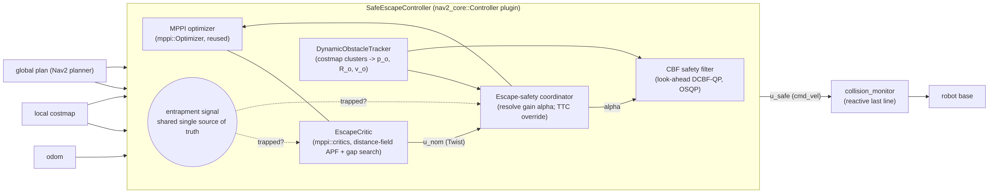
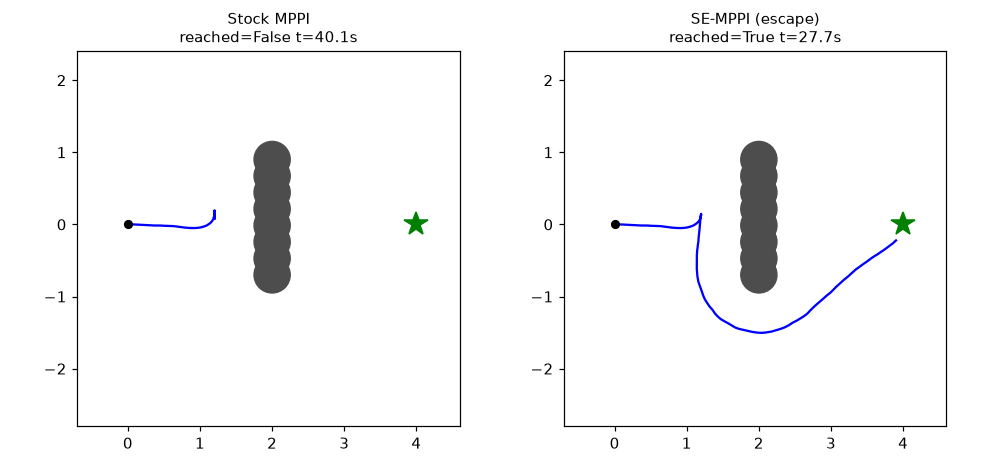
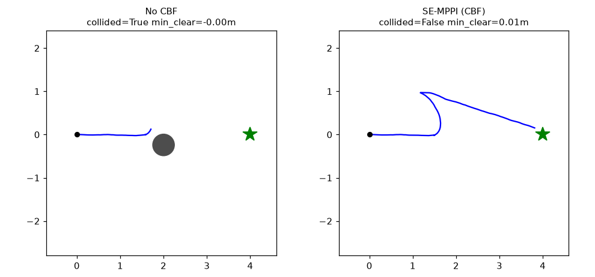
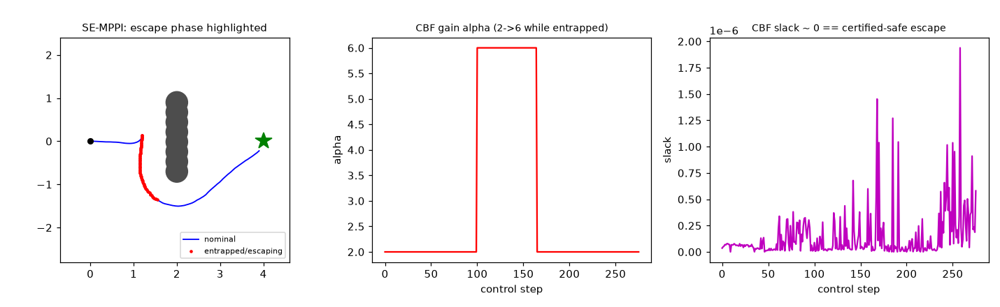

# Safe-Escape MPPI: Coordinating Online Local-Minima Escape with Control-Barrier-Function Safety in a Nav2-Native Controller

> ## SUPERSEDED — the current manuscript is `docs/papers/latex/main.tex`
>
> **This file is a historical working draft (2026-06-10), kept for the
> record. The current, complete version is `docs/papers/latex/main.tex`
> (compiled: `docs/papers/latex/main.pdf`).** Two things below are stale in
> particular: (1) the Sec. VI-C cells marked *pending* **have since been
> measured** — the randomized 1,200-trial 2D benchmark is reported in
> `docs/papers/2026_2d-benchmark-results.md` with raw data under
> `experiments/results_2d/`; (2) the "IEEE CASE 2025" venue attribution for
> DRPA-MPPI did not survive reference verification ("submitted to", not
> accepted — see `docs/papers/reference-verification-report.md`). Do not
> cite this file; cite `main.tex`/`main.pdf`.
>
> **Prior-art revision (2026-09-30).** The passages below were brought in
> line with the narrowed claims of the current manuscript: SE-MPPI is
> presented as a system that integrates known pieces inside one Nav2
> controller plugin, not as the first work to treat escape and safety
> together; Nav2's stack-level stall recovery, the 3Laws Supervisor
> integration, GP-MPPI, gap-based planners, backup-trajectory MPC,
> modulated CBFs and online CBF-gain adaptation are now discussed; and the
> invariance proposition is restated as a conditional lemma after adaptive
> CBFs, not as a new result or an unconditional safety certificate. The
> historical scope of this draft (no benchmark results) is unchanged.

> **Status:** complete working draft (2026-06-10). Mechanism validation and live
> integration results are measured; the large-scale quantitative benchmark
> (Sec. VI-C) is specified but **not yet run** — those cells are marked *pending*
> and MUST NOT be cited as results until measured.
> **Target venue:** IEEE RA-L (+ ICRA). **Code:** `src/nav2_se_controller` (Apache-2.0).
> **Citation reliability:** external numbers are self-reported / search-derived
> unless marked verified; originals to be re-checked before camera-ready.

---

## Abstract

Sampling-based model predictive control — in particular the Model Predictive
Path Integral (MPPI) controller shipped with ROS 2 Nav2 — is a widely used
deployable local controller for mobile robots, yet it has two weaknesses that
surface *together* in narrow, crowded, dynamic spaces: (i) a finite horizon and
Gaussian sampling make it prone to **local-minima entrapment** (U-shaped or
symmetric obstacle fields, tight gaps), and (ii) its critics avoid collisions only
through **soft cost terms with no formal safety guarantee** and no prediction of
moving obstacles. Methods exist for each weakness, and several works outside Nav2
address both together, but we know of no public Nav2 controller plugin that
combines local-minima escape with a barrier-based safety filter. This system paper
presents **Safe-Escape MPPI (SE-MPPI)**, a Nav2 controller plugin that integrates
online local-minima **detection-and-escape** for MPPI (distance-field APF +
free-space gap search) with a **control-barrier-function (CBF) safety filter** for
tracked dynamic obstacles. One path-progress entrapment signal switches the escape
costs into the MPPI rollouts and, through an **escape–safety coordinator**, raises
the barrier's class-$\mathcal{K}$ gain. By a standard argument for time-varying CBF
gains, this schedule preserves forward invariance of the barrier's safe set, a
conditional guarantee that covers only a look-ahead point and the tracked dynamic
obstacles, assumes that the barrier inequality holds between control updates, and
requires the quadratic program (QP) to use no slack, a condition that the QP of the
later randomized benchmark violates at least once in most trials with moving
obstacles. We implement SE-MPPI as a `nav2_core` controller plugin plus an MPPI
critic, validate each mechanism in a standalone 2D mirror of the controller's
primitives, and demonstrate that the controller loads, activates, and produces
valid commands inside a full live ROS 2 Jazzy + Nav2 + Gazebo stack, although no
live run has yet reached its goal. A large-scale quantitative benchmark
(BARN/DynaBARN/HuNavSim) is specified as the remaining step.

---

## I. Introduction

Autonomous mobile robots increasingly operate in cluttered, dynamic indoor
environments — warehouses, hospitals, service floors — where the local controller
must be simultaneously *fast*, *non-conservative*, and *safe*. Within the ROS 2
Nav2 ecosystem, the MPPI controller (`nav2_mppi_controller`) is a widely used
high-performance option: it supports differential, omnidirectional, and
Ackermann robots and runs at 50+ Hz on CPU by sampling `batch_size` rollouts,
scoring them with a bank of critics, and combining them with an
information-theoretic softmax.

Two weaknesses, however, recur exactly in the environments that matter most:

1. **Local-minima entrapment.** A finite prediction horizon (by default
   $56 \times 0.05\,\mathrm{s} \approx 2.8\,\mathrm{s}$) and zero-mean Gaussian
   sampling cause the robot to stall or oscillate in non-convex traps. Within the
   MPPI critic set, Nav2's mitigations (`PreferForwardCritic`, `TwirlingCritic`)
   are *always-on* cost shaping that neither *detects* entrapment nor steers an
   escape. At the stack level, Nav2 does detect a stall: the controller server's
   progress checker reports a failure when the robot has not moved a set distance
   within a set time, and the default behavior tree then clears the costmaps and
   runs generic recoveries such as spinning, waiting, and backing up (Nav2
   `nav2_controller` source; Nav2 behavior-tree documentation). These recoveries
   are not directed toward an opening. In the MPPI literature, escape methods
   either reshape the sampling distribution all the time (log-MPPI, Tsallis-MPPI,
   SVG-MPPI, Biased-MPPI, learned proposals) or add guidance: GP-MPPI recommends a
   free-space subgoal from a learned navigability surface, and repulsive-potential
   augmentation adds an artificial potential field to the MPPI cost (Fuke et al.,
   SII 2025), which DRPA-MPPI switches on only when it detects entrapment. None of
   these carries a safety certificate.
2. **No formal safety.** In Nav2 MPPI, avoidance is encoded as soft costs
   (`ObstaclesCritic`, `CostCritic`); there is no forward-invariance guarantee, and
   crucially **no prediction of dynamic-obstacle motion** — the costmap is a
   present-time snapshot and `collision_monitor` is purely reactive. CBF–MPPI
   fusions supply safety (Shield-MPPI, BR-MPPI, SCBF-MPPI, DualGuard, GS-MPPI), but
   none of them detects entrapment or adds an escape mechanism (GS-MPPI counters
   the myopic behavior often associated with CBFs through long-term performance
   terms), and none ships as a Nav2 controller. Among CBF integrations with Nav2
   that we could verify, the Nav2 documentation describes inserting a third-party
   product, the 3Laws Supervisor, which its vendor describes as based on CBFs, into
   the command chain after the controller; it is a separate node rather than a
   controller plugin, and neither source describes a mechanism for escaping local
   minima.

These weaknesses also interact: being conservative for safety invites entrapment,
and escaping aggressively invites collision. Several works outside Nav2 and MPPI
address both at once, among them model predictive control that escapes local
minima while keeping a safe backup trajectory (Soloperto et al.), gap-based local
planners with provable collision-free properties (Potential Gap, Safer Gap,
Dynamic Gap), and modulated CBF filters (Xue and Figueroa) that reduce or
eliminate, among moving obstacles, the spurious equilibria that CBF quadratic
programs can introduce (Reis et al.), with concurrent extensions (Xue et al. 2026;
Chen et al. 2026). Fig. 2 (Sec. VI-A) illustrates the first weakness and SE-MPPI's
response in the standalone 2D mirror of the controller's primitives: stock MPPI
stalls in front of a U-shaped trap while SE-MPPI detects the entrapment and rounds
it. In SE-MPPI, the entrapment detector is driven by monotone progress along the
global path and runs inside the controller rather than at the stack level. This is
a system contribution, and we state it as such.

**Contributions.**
- **C1 (system).** A public **Nav2 local-controller plugin** that combines online
  local-minima detection-and-escape with a CBF safety filter for tracked dynamic
  obstacles, packaged as a `nav2_core::Controller` plus a pluginlib MPPI critic.
  Each ingredient has precedent: gated repulsion in DRPA-MPPI, free-space subgoal
  and gap guidance in GP-MPPI and gap-based planners (Potential Gap, Safer Gap),
  CBF filtering of MPPI commands (SCBF-MPPI), and a supervisor for Nav2 that its
  vendor describes as CBF-based (3Laws Supervisor). What is new is their
  integration inside one Nav2 controller; to our knowledge no public controller
  plugin already provides it.
- **C2 (algorithm).** An **entrapment-gated gain schedule**: a rule that raises the
  CBF class-$\mathcal{K}$ gain on detected entrapment and drops it back on an
  imminent time-to-collision (TTC). Online adaptation of CBF gains is established,
  including selecting class-$\mathcal{K}$ parameters to reduce predicted deadlock
  (Kim, Kee, and Panagou, ICRA 2025) and letting MPPI optimize a barrier-rate
  parameter (BR-MPPI); our rule is a simpler, rule-based two-level instance of
  online gain adaptation whose specific elements are its trigger and its TTC
  override. Its invariance property (Sec. IV-E) is a known result for time-varying
  class-$\mathcal{K}$ terms (adaptive CBFs, Xiao et al.; rate-tunable CBFs,
  Parwana and Panagou), which we restate as a conditional lemma: it covers the
  look-ahead point and the tracked dynamic obstacles, assumes the barrier
  inequality holds between samples, and requires a slack-free QP.
- **C3 (dynamic safety).** Integration of a look-ahead-point CBF safety filter for
  a differential-drive robot, fed by a costmap-based dynamic-obstacle tracker, as a
  QP at the controller's output.
- **C4 (reproducibility).** An open Apache-2.0 implementation, a standalone 2D
  mechanism validation, and a specified ROS 2 benchmark protocol.

We are deliberately conservative about novelty: fusing CBFs with MPPI is *not* new,
and neither is gated escape, online adaptation of the CBF gain, or treating escape
and safety together; the paper is best read as a system report on putting these
pieces into one Nav2 controller. Our claims are (i) Nav2-native deployment, (ii) the
escape–safety coordination as a mechanism with a conditional invariance property,
not as an empirical gain, and (iii) a dynamic CBF in a differential-drive MPPI with
a reproducible benchmark protocol. No live run has yet reached its goal, and no
stack-level or third-party baseline has been run.

---

## II. Related Work

**MPPI and local controllers.** Nav2 MPPI, TEB, DWB, and Regulated Pure Pursuit are
the standard deployable local planners. MPPI's critic-plugin interface
(`mppi::critics::CriticFunction`) exposes per-rollout trajectories, the reference
path, the goal, collision flags, and the furthest-reached path index — i.e., the
signals needed for entrapment detection are already available, and a custom critic
can be inserted without forking the optimizer. Around the controller, Nav2 already
handles stalls at the stack level: the controller server runs a progress checker,
by default `SimpleProgressChecker`, which reports a failure when the robot has not
moved a set radius within a set time allowance, and the default behavior tree
answers with costmap clearing, spinning, waiting, and backing up. SE-MPPI's
detector differs in that it runs inside the controller on progress along the path
and steers the escape instead of triggering generic recoveries; the two mechanisms
can coexist.

**Local-minima escape.** Most escape methods for MPPI are *always-on* changes of
the sampling distribution: log-MPPI, Tsallis-MPPI, SVG-MPPI (Stein mode-seeking),
Biased-MPPI, and learned proposals (FlowMPPI). Others add guidance. GP-MPPI
(Mohamed et al., IROS 2023) learns a sparse-Gaussian-process model of the navigable
space around the robot and recommends a free-space subgoal to the local MPPI
planner, which lets the robot escape local minima without a global map. Fuke et al.
add a repulsive artificial potential to MPPI to avoid local minima without global
path guidance (SII 2025), and their **DRPA-MPPI** detects potential entrapment on
the predicted trajectories and only then switches to a cost with repulsion away
from the local minimum. DRPA-MPPI is the closest *detect-and-switch* method and
GP-MPPI the closest subgoal method; neither has a CBF or other formal safety layer,
and neither is Nav2-integrated. SE-MPPI combines both ideas in a simpler form, a
path-progress stall detector gating a classical repulsive potential (Khatib, 1986)
and a ray-cast gap bearing, and its safety filter runs alongside the escape rather
than gating it. Gap-based local planners are closer still to the overall
architecture. Potential Gap combines gap-based local navigation with artificial
potential fields and restores provable collision-free properties for realistic
robot models; Safer Gap adds nonlinear model predictive control with keyhole
zeroing-barrier-function constraints and a point-wise optimization-based safety
filter as the final layer; and Dynamic Gap extends provably collision-free
gap-based navigation to dynamic environments by modeling how gaps evolve over time.
Relative to this line, SE-MPPI uses a gap only as a gated escape heuristic inside
MPPI, and its barrier covers only tracked dynamic obstacles.

**Escape and safety together.** Several works treat entrapment and safety jointly.
Soloperto et al. optimize an exploration trajectory together with a safe backup
trajectory in a model predictive controller and prove convergence, feasibility, and
constraint satisfaction under partially unknown constraints. The modulated CBF-QP
of Xue and Figueroa reduces or eliminates, in dynamic environments, the spurious
equilibria that CBF-QP filters create (Reis et al.), and was tested on Ridgeback and
Fetch robots. Concurrent work adds learned predictive barriers for moving concave
obstacles to this filter (Xue et al. 2026), and pairs a mixed-integer MPC planner
with a Minkowski-difference CBF filter to mitigate the local-minimum behavior of
reactive CBF navigation in U-shaped and maze-like environments (Chen et al. 2026).
These methods mitigate or avoid minima inside the planner or the barrier itself,
whereas SE-MPPI leaves the barrier unchanged and escapes through the MPPI cost. None
of them is packaged as a Nav2 controller.

**CBF × MPPI safety.** Three fusion styles exist as research code: CBF conditions
in the rollout cost or the sampling (Shield-MPPI, which adds a local repair step,
and BR-MPPI, which imposes the CBF condition as an equality with a parametric
linear class-$\mathcal{K}$ function, augments the state with its parameter, and
lets MPPI optimize the parameter's rate as an extra input), an output CBF-QP filter
on the MPPI command (SCBF-MPPI, built on the CBFKit toolbox), and per-rollout safety
filtering that makes every sample provably safe (GS-MPPI; DualGuard, which also
filters the final command). For dynamic obstacles, DPCBF ("Beyond Collision Cones")
uses a parabolic safe set that is less conservative than collision-cone barriers
but is QP-only and not embedded in MPPI. None of these works ships as a Nav2
controller (CBFKit builds a standalone node), and none detects entrapment or adds
an escape mechanism, although GS-MPPI counters the myopic behavior often associated
with CBFs through long-term performance terms. Among Nav2 integrations of a CBF that
we could verify, the official Nav2 documentation describes inserting the
third-party 3Laws Supervisor, which its vendor describes as based on CBFs, between
the velocity smoother and the collision monitor; it acts on the controller's output
as a separate node, and neither source describes a local-minimum escape mechanism.
SE-MPPI instead places its filter inside the controller and couples it to the
escape layer through its gain.

**Online adaptation of the CBF gain.** Time-varying and adapted
class-$\mathcal{K}$ terms are well studied. Adaptive CBFs (Xiao, Belta, and
Cassandras) multiply the class-$\mathcal{K}$ functions by time-varying penalty
functions and prove forward invariance of the safe set; optimal-decay CBF-QPs
(Zeng et al., ACC 2021) optimize the decay rate point-wise in time to keep the QP
feasible; and rate-tunable CBFs (Parwana and Panagou, ACC 2025) adapt the
class-$\mathcal{K}$ functions online and derive conditions under which multiple
constraints can share the control input. Closest to our trigger, Kim, Kee, and
Panagou (ICRA 2025) adapt the parameters of input-constrained CBFs online with a
learned ensemble model and select, among the candidates that pass their uncertainty
and risk checks, the class-$\mathcal{K}$ parameters with the minimum predicted
deadlock time; BR-MPPI lets MPPI optimize the class-$\mathcal{K}$ parameter
directly. Concurrent work switches nominal objectives when CBF and control-Lyapunov
constraints conflict, to reduce slowdowns and deadlocks (Walia and Leahy 2026), and
schedules the gain of a frontier barrier on an occupancy grid by how well the map is
explored (Paudel et al. 2026). SE-MPPI's coordinator is a rule-based, two-level
instance of this idea, triggered by the entrapment flag and overridden by
time-to-collision, and its invariance property (Sec. IV-E) follows the same
argument as the relative-degree-one case of the adaptive-CBF result (Xiao et al.,
Thm. 3), there stated for Lipschitz controllers.

**Conformal prediction for safe control (background, not claimed).** The released
controller carries an online conformal margin that inflates the CBF effective radius
under prediction uncertainty; this is an *implementation detail deferred to follow-up
work* (Sec. VII, SE-Predict) and is **not** a contribution of this paper. For the record,
that margin draws on the established line of conformal-prediction-for-safe-control work:
adaptive conformal prediction fused with safety-critical control [Yang et al., ACC 2024,
arXiv:2407.03569], conformal risk control for HRI safety margins [arXiv:2603.10392],
conformal-prediction-based safe planning in dynamic environments [Lindemann et al.,
RA-L 2023, arXiv:2210.10254], adaptive conformal prediction for motion planning among
dynamic agents [Dixit et al., L4DC 2023, arXiv:2212.00278], and uncertainty-aware
predictive CBFs [UA-PCBF, arXiv:2508.20812]. We cite these only as lineage for the
deferred margin — Paper 1's claims are C1–C4 and stand without it.

**Positioning.** The table below places the reviewed systems against four factors:
**(a)** shipping as a Nav2 controller plugin, **(b)** online local-minimum escape or
avoidance, **(c)** an explicit run-time safety constraint, filter or backup, and
**(d)** online adaptation of the class-$\mathcal{K}$ gain. No reviewed system holds
all four, but several hold two, fully or in part: stock Nav2 pairs its controller
plugins with stack-level stall recovery, gap-based planners, backup-trajectory MPC
and modulated CBFs combine local-minimum handling with a safety layer, and
adaptive-gain CBFs and BR-MPPI pair a barrier with gain adaptation, with
deadlock-aware adaptation also holding the second factor in part. The delta of
SE-MPPI is therefore the conjunction inside one Nav2 controller plugin, not any
single element. Its own marks are not all full: its barrier covers only tracked
dynamic obstacles, and its escape is demonstrated only in the Python 2D mirror. Its
gain rule differs from prior gain adaptation mainly in its trigger, and the later
randomized benchmark could not measure an outcome benefit from it.

| System | (a) | (b) | (c) | (d) |
|---|---|---|---|---|
| Nav2 MPPI with progress checker and recoveries | ✓ | ◦ | – | – |
| 3Laws Supervisor in Nav2 | ◦ | – | ✓ | – |
| DRPA-MPPI, GP-MPPI | – | ✓ | – | – |
| Dynamic Gap, Potential Gap | – | ◦ | ◦ | – |
| Safer Gap | – | ◦ | ✓ | – |
| Backup-trajectory MPC (Soloperto et al.) | – | ✓ | ✓ | – |
| MILP-MPC with CBF†; MCBF-QP; predictive MCBF† | – | ✓ | ✓ | – |
| DualGuard, SCBF-MPPI, GS-MPPI, Shield-MPPI | – | – | ✓ | – |
| CBFKit, DPCBF | – | – | ✓ | – |
| BR-MPPI | – | – | ✓ | ✓ |
| Rate-tunable, adaptive, optimal-decay CBFs | – | – | ✓ | ✓ |
| Deadlock-aware parameter adaptation (Kim et al.) | – | ◦ | ✓ | ✓ |
| **SE-MPPI (ours)** | ✓ | ✓ | ◦ | ✓ |

✓ = holds; ◦ = holds in part: stock Nav2 detects stalls at the stack level and runs
generic recoveries rather than a steered escape; the 3Laws Supervisor is integrated
with Nav2 as a separate node after the controller, not as a controller plugin; the
gap-based planners guide the robot through free-space gaps rather than escaping a
detected minimum, and the provable collision-free properties of Potential Gap and
Dynamic Gap follow from the planners' gap construction rather than from an explicit
run-time constraint or filter; Kim et al. reduce predicted deadlock through
class-$\mathcal{K}$ parameter selection rather than escaping a detected minimum. For
(c): DualGuard uses Hamilton–Jacobi reachability, Soloperto et al. a safe backup
trajectory, and Safer Gap zeroing barrier functions. For the 3Laws Supervisor, (b)
is marked absent because neither cited source describes a local-minimum escape
mechanism. †Concurrent work (posted in 2026). For SE-MPPI, (c) is marked in part
because its barrier covers only tracked dynamic obstacles, at a look-ahead point,
and its invariance argument is conditional (Sec. IV-E); static structure is handled
only by MPPI costs. Its (b) is demonstrated only in the Python 2D mirror, not in a
live Nav2 run. The review behind this table (June 2026, extended in September 2026)
covered the Nav2 MPPI critic ecosystem, the Nav2 documentation, the public issue
trackers of these projects, and the works cited here; it is not exhaustive.

---

## III. Problem Formulation

Consider a differential-drive robot with pose $(x,y,\theta)$ and control
$u=(v,\omega)$, tracking a global path $\sigma$ produced by a Nav2 global planner,
amid static structure and a set $\mathcal{O}$ of dynamic obstacles $o$ with position
$p_o$, radius $R_o$, and (estimated) velocity $v_o$. Let $r$ be the robot's inscribed
radius and $m$ a safety margin. We want a control policy that (G1) makes monotone
progress along $\sigma$ — i.e., does not stall in a local minimum — and (G2) keeps
the robot clear of the obstacles in $\mathcal{O}$ through a barrier whose forward
invariance holds under stated conditions, while (G3) running as a Nav2 controller at
$\geq 10$ Hz on CPU.

The tension: G1 may require maneuvers that approach obstacles (to round a trap),
whereas a naive safety filter for G2 forbids exactly those maneuvers. SE-MPPI's
coordinator (Sec. IV-E) couples the escape layer for G1 and the barrier for G2
through the barrier gain.

---

## IV. Method: SE-MPPI

### A. Overview

SE-MPPI subclasses the stock `MPPIController`, reusing its optimizer for the nominal
command, then post-processes that command each cycle:

1. **Entrapment detection** from monotone global-path progress (single source of
   truth, shared with the critic).
2. **Escape** at sampling time: an `EscapeCritic` injects distance-field APF and
   free-space gap-attraction costs *only when entrapment is detected*.
3. **Dynamic-obstacle tracking** from the local costmap.
4. **Coordination**: resolve the CBF gain $\alpha$ from entrapment and TTC.
5. **CBF safety filter**: project the nominal $(v,\omega)$ onto the CBF-safe set via
   a small QP.

The escape and safety layers thus act at complementary points — sampling-time cost
shaping and output-time projection — unified by a shared entrapment signal and the
coordinated gain.

**Fig. 1.** SE-MPPI data flow. Global plan, local costmap, and odometry feed the
`SafeEscapeController` plugin: the reused MPPI optimizer (with the `EscapeCritic`)
emits the nominal command, a shared entrapment signal drives both the critic and the
escape–safety coordinator, the coordinator resolves the CBF gain $\alpha$ (with TTC
override), and the CBF safety filter — fed by the `DynamicObstacleTracker` — projects
the command to `cmd_vel`, which Nav2's `collision_monitor` guards as a final reactive
layer. (Source: `figures/architecture.mmd`, Mermaid.)

### B. Entrapment detection (single source of truth)

`nearestPathIndex(\sigma)` is non-monotone, so we track the **furthest reached** path
index $k_{\max}$ and declare entrapment when $k_{\max}$ fails to advance for a window
of $W$ cycles (default 20–30). Entrapment is suppressed within a goal tolerance so a
robot finishing at the path end does not trigger a false escape. Within SE-MPPI, the
controller's detector is the single entrapment source; the `EscapeCritic` and the
coordinator read the same shared atomic state via a registry keyed by the controller
name, so escape and safety always agree on whether the robot is trapped.

### C. Escape (detect-and-switch)

On entrapment the `EscapeCritic` adds two cost terms to the MPPI rollouts:
- **Distance-field APF** of the classical repulsive form (Khatib, 1986),
  $U=\tfrac12\eta\,(1/d - 1/d_0)^2$ for $d<d_0$, where $d$ is the Dijkstra distance
  to the nearest obstacle cell (excluding unknown space), which pushes rollouts off
  the trapping surface; and
- **Free-space gap attraction**: repulsion alone does not route the robot *around* a
  non-convex (U-shaped) trap, so a ray-cast around the robot finds the opening whose
  bearing is closest to the goal direction and whose clearance exceeds a threshold,
  and rollouts whose endpoint heads toward that gap are rewarded — a temporary
  heading toward an opening (a bearing cost; the goal itself is unchanged), a
  lightweight form of the free-space subgoal and gap guidance of GP-MPPI and
  Potential Gap.

Because the terms are injected only when entrapped, free-space behavior is unchanged
(detect-and-switch, not always-on, as in DRPA-MPPI). The later 2D mirror benchmark
(see the banner) uses the selected bearing as a temporary subgoal rather than
through this bearing cost; there, disabling the gap search removes every escape,
whereas the gap cost of the C++ critic has not been ablated on its own.

### D. CBF safety filter (dynamic obstacles)

To make the barrier relative-degree one in $(v,\omega)$ for a unicycle, safety is
enforced on a **look-ahead point** $P = (x,y) + L\,(\cos\theta,\sin\theta)$, which is
fully actuated by $(v,\omega)$ through the Jacobian
$G=\begin{bmatrix}\cos\theta & -L\sin\theta\\ \sin\theta & L\cos\theta\end{bmatrix}$.
For each obstacle $o$ with $d=P-p_o$ and effective radius $R = r + R_o + m$:
$$h_o = \lVert d\rVert^2 - R^2, \qquad \dot h_o = 2\,d^\top (G\,u - v_o).$$
The continuous-time CBF condition $\dot h_o + \alpha\,h_o \ge 0$, enforced once per
control cycle, is linear in $u$. We solve a
small QP (OSQP) that minimizes $\lVert u - u_\text{nom}\rVert^2 + \rho\,\delta^2$
subject to the per-obstacle CBF rows (relaxed by a single slack $\delta\ge0$ for
feasibility) and the input box limits. Obstacles are pruned to the nearest few by
*clearance* (surface gap), not center distance. If the QP can only stay safe by
relaxing the barrier ($\delta>\epsilon$) or fails, the controller brakes the forward
velocity to zero while keeping the safest available turn — stop rather than drive into
an imminent collision. Static structure is intentionally **excluded** from the CBF
(handled by the MPPI obstacle critic and costmap inflation); only obstacles that are
moving and small enough to be a movable body are admitted, which we found essential in
a real costmap (Sec. VI-B).

Because this condition is checked once per control cycle (a sampled-data CBF), strict
between-sample forward invariance would require a sampled-data margin tightening $R$ by
an $O(\dot h_{\max}\Delta t)$ term; in practice the obstacle-radius margin $m$ absorbs
this gap, and we report the empirical safety rate rather than claim continuous-time
invariance between samples.

### E. Escape–safety coordination: gain scheduling under a conditional invariance lemma

The coordinator resolves the gain:
$$\alpha = \begin{cases}
\alpha_\text{base} & \text{not entrapped, or TTC} < \tau \text{ (imminent)}\\
\alpha_\text{escape} & \text{entrapped and TTC} \ge \tau
\end{cases}$$
with $\alpha_\text{escape} > \alpha_\text{base} > 0$, where TTC is the minimum
time-to-collision over tracked obstacles under the current command. Raising $\alpha$
relaxes the constraint $\dot h \ge -\alpha h$ — permitting the robot to approach an
obstacle faster, as an escape maneuver requires — while the TTC override snaps the
gain back to $\alpha_\text{base}$ (safety first) when a dynamic obstacle is imminent.
The next result states that, under explicit conditions, this schedule does not by
itself give up forward invariance. It is a known property of CBFs with time-varying
class-$\mathcal{K}$ terms and follows the same argument as the relative-degree-one
case of the invariance result for adaptive CBFs with time-varying penalty functions
(Xiao, Belta, and Cassandras, Thm. 3), which is stated there for
Lipschitz-continuous controllers, whereas our switched gain yields a discontinuous
command; related time-varying and optimized decay rates appear in optimal-decay CBFs
(Zeng et al.) and rate-tunable CBFs (Parwana and Panagou). We restate it with the
standard integrating-factor proof for completeness and claim no new mathematics.

**Proposition (invariance under a time-varying gain; after Xiao, Belta, and
Cassandras).** *Fix an obstacle $o$. Suppose that, throughout the interval
considered, the QP is feasible with $\delta=0$ and the continuous-time inequality
$\dot h_o(t) \ge -\alpha(t)\,h_o(t)$ holds for almost every $t$ — an assumption
between samples, since QP feasibility at discrete instants does not by itself imply
it — for a measurable, positive, bounded gain schedule $\alpha(t)$, including the
entrapment-triggered switch $\alpha_\text{base}\!\to\!\alpha_\text{escape}$ and the
TTC override. If $h_o(0)\ge0$, then $h_o(t)\ge0$ for all $t$ — the look-ahead point
$P$ does not enter obstacle $o$'s inflated disc, as modeled (body safety
approximate; see §VII).*

*Proof.* Let $\varphi(t)=\exp\big(\int_0^t\alpha(s)\,ds\big)$, finite and strictly
positive. Almost everywhere,
$\frac{d}{dt}[\varphi h_o]=\varphi\,(\dot h_o+\alpha h_o)\ge0$, so $\varphi h_o$ is
non-decreasing and $\varphi(t)h_o(t)\ge h_o(0)\ge0$; since $\varphi>0$,
$h_o(t)\ge0$.∎ Positivity and boundedness are stronger than the argument needs: a
nonnegative, locally integrable $\alpha$ already makes $\varphi$ finite and
positive.

Under these conditions, raising the gain therefore does not permit $h_o<0$; it only
enlarges the admissible control set inside the same set. This is the design
rationale for coordinating rather than stacking the two layers: in this idealized
setting, the gain trades caution for maneuverability without giving up invariance.
The guarantee is narrow. It concerns the look-ahead point, not the robot body; it
covers only the tracked dynamic obstacles under the constant-velocity model, not
static structure; it applies to an obstacle only while that obstacle stays in the
tracked, unpruned set $\mathcal{O}$ (an obstacle that slows below the speed threshold
for dynamic obstacles, merges into a cluster too large to be a movable body, or is
pruned beyond the nearest few by clearance leaves the QP); it assumes the
continuous-time inequality between samples; and it requires $\delta=0$, so it does
not cover any cycle in which the QP uses slack (the QP of the later randomized
benchmark does so at least once in most trials with moving obstacles). In cycles
with $\delta>\epsilon$ the brake replaces the QP command, and
bounded-prediction-error robustness is the subject of follow-up work (Sec. VII).

### F. Dynamic-obstacle tracking

The tracker clusters costmap cells above a lethal threshold, associates each current
cluster to at most one previous cluster within a gate (so a split/merge cannot
manufacture a phantom velocity), and estimates a clamped constant velocity. Its output
$\{p_o, R_o, v_o\}$ feeds the coordinator (TTC) and the CBF filter. The constant-
velocity model is a deliberate, replaceable baseline (Sec. VII).

---

## V. Implementation (Nav2-native)

SE-MPPI is built on ROS 2 Jazzy + Nav2. The package `nav2_se_controller` ships three
shared libraries: a plugin-free `se_mppi_core` (entrapment, CBF, coordinator, tracker,
repulsion, gap search), the `escape_critic` MPPI critic, and the
`safe_escape_controller`. Separating the plugin-free core from the two plugin
libraries resolves a `class_loader` factory conflict that otherwise prevents the
critic and controller from co-loading.

Two integration details proved essential and are easy to get wrong:
- **Critic namespace.** Nav2's `CriticManager` resolves a critics-list entry `NAME`
  to the plugin class `mppi::critics::NAME`. A critic in any other namespace can be
  unit-tested via pluginlib directly but will **never** load from the critics list.
  `EscapeCritic` therefore lives in `mppi::critics`.
- **Jazzy critic data uses xtensor**, not the Eigen of the `main` branch; the critic
  was written against the installed headers.

The QP uses `osqp-eigen`. The build is reproducible via RoboStack (conda-forge) so it
runs OS-version-independently (validated on Ubuntu 20.04 with an NVIDIA GPU). The
package carries **40 unit tests** (gtest) across the entrapment detector, CBF filter,
coordinator, tracker, gap search, repulsion, path progress, and plugin loading, plus
linters.

---

## VI. Experiments

### A. Mechanism validation (standalone 2D)

To validate each mechanism independently of simulator infrastructure, we reimplement
the controller's core math (APF, gap raycast, look-ahead CBF-QP via OSQP, $\alpha$
modulation + TTC override, monotone-progress entrapment) as a 2D unicycle and run
three scenarios. The 2D code reuses the controller's formulas but differs from the
Nav2 controller in documented ways (for example, analytic circular geometry instead
of a costmap, and distance-to-goal progress instead of a global path); in these
three scenes its CBF sees all obstacles, including the static wall discs.
**Measured results:**

| Scenario / config | reached | collided | time | min-clear (m) |
|---|---|---|---|---|
| U-trap / Stock MPPI | ✗ (stuck) | — | — | 0.33 |
| U-trap / SE-MPPI (escape) | ✓ | — | 27.7 s | 0.32 |
| Dynamic / No CBF | ✗ | **collision** | — | −0.00 |
| Dynamic / SE-MPPI (CBF) | ✓ | safe | 18.6 s | 0.01 |
| Coordination / SE-MPPI vs independent | ✓ | safe | 27.7 s | 0.32 |

Three findings: (1) stock MPPI stalls in front of a U-trap while SE-MPPI detects and
rounds it; (2) against a crossing dynamic obstacle, the no-CBF baseline collides while
the speed-aware CBF filter avoids it; (3) **the coordination plot shows the gain rise
$\alpha: 2 \to 6$ during the escape phase with slack $\approx 0$ throughout** — i.e.,
the escape maneuver is admitted without relaxing the barrier, close to the
slack-free setting that the Proposition of Sec. IV-E assumes. In these benign
scenarios the coordinated and independent variants are both safe; whether
coordination yields a *quantitative* outcome benefit was left to the benchmark of
Sec. VI-C, and the randomized 2D benchmark run since (see the banner) found it null
in the regimes it could reach.

These three findings are shown in Figs. 2–4 (sources in `figures/`; generated by
`experiments/prototype/run_validation.py`):

**Fig. 2.** U-trap escape. Stock MPPI (left) stalls at the trap mouth ($x\approx1.2$,
no progress); SE-MPPI (right) detects the stalled progress and rounds the U-shaped
obstacle to the goal via the gap-attraction subgoal. Trajectories only; no benchmark
metrics. (Source: `figures/utrap_escape.png`.)

**Fig. 3.** Dynamic-obstacle avoidance. Against a crossing obstacle, the no-CBF
baseline (left) collides while the speed-aware look-ahead CBF filter (right) projects
the command to a collision-free path. (Source: `figures/dynamic_cbf.png`.)

**Fig. 4.** Escape–safety coordination. During the escape phase the coordinated gain
rises $\alpha: 2 \to 6$ while the QP slack stays $\approx 0$ throughout — the escape
maneuver is admitted without relaxing the barrier, close to the slack-free setting
that the Proposition of Sec. IV-E assumes. (Source: `figures/coordination.png`.)

### B. Live Nav2 + Gazebo integration

We deployed SE-MPPI in a complete live stack (ROS 2 Jazzy, Nav2 — AMCL, costmaps,
NavFn, BT navigator, recovery, collision monitor — and Gazebo `tb3_sandbox`) on the
target workstation. Confirmed: the controller and `EscapeCritic` **load and
activate**, the controller **produces valid velocity commands** identical in form to
stock MPPI, and the full lifecycle reaches the active state. This is the integration
the design targets — research that is simultaneously a deployable artifact. No
end-to-end Nav2 escape has been demonstrated, however: no live run has yet reached
its goal.

Two real-costmap behaviors surfaced that a pure-2D study cannot: (i) feeding *static
walls* into the CBF (every lethal cluster) makes the barrier infeasible everywhere and
freezes the robot — fixed by scoping the CBF to genuinely dynamic obstacles
(Sec. IV-D); and (ii) the per-cycle compute budget must be matched to the host
(horizon preserved, rate and batch reduced) or the loop misses its rate and the
optimizer diverges. Both are reported as deployment lessons.

### C. Large-scale quantitative benchmark — *protocol specified, results pending*

The headline comparison is specified but **not yet measured**; the table below is the
template to be filled, and these cells must not be cited until run.

- **Setup.** Identical Nav2 stack and differential robot; three tiers — BARN (static
  difficulty), DynaBARN (dynamic), HuNavSim (human-aware). Metrics: success rate,
  collision rate, time-to-goal, path length, minimum clearance, per-cycle compute.
- **Baselines.** Stock MPPI, DWB, RPP, TEB; an always-on variant of our escape
  critic; CBF-only (Shield-style). The prior work of Sec. II also calls for stock
  MPPI with Nav2's progress checker and behavior-tree recoveries enabled,
  DRPA-MPPI itself, a GP-MPPI-style subgoal escape, a gap-based planner (Safer Gap),
  and an adaptive-gain CBF (Kim, Kee, and Panagou).
- **Ablations (A–F).** The key contrast is **E (escape and CBF, independent) vs F
  (escape and CBF, coordinated)** — isolating C2.
- **Statistics.** McNemar (success; McNemar, 1947) and Mann–Whitney (continuous;
  Mann and Whitney, 1947) with Holm correction (Holm, 1979); effect sizes (Cliff's
  $\delta$; Cliff, 1993).

| Method | Success ↑ | Collision ↓ | Time ↓ | Min-clear ↑ |
|---|---|---|---|---|
| Stock MPPI | *pending* | *pending* | *pending* | *pending* |
| Escape-only (E) | *pending* | *pending* | *pending* | *pending* |
| CBF-only | *pending* | *pending* | *pending* | *pending* |
| **SE-MPPI coordinated (F)** | *pending* | *pending* | *pending* | *pending* |

---

## VII. Limitations

- **Quantitative benchmark not yet run.** The mechanism (VI-A) and integration (VI-B)
  are validated; the comparative success/collision numbers (VI-C) remain to be
  measured. We do not claim them. No live run has yet reached its goal, so
  controller-level escape in Nav2 is not demonstrated, and none of the baselines
  called for by the prior work of Sec. II (Nav2's own stall recovery, DRPA-MPPI, a
  GP-MPPI-style subgoal escape, a gap-based planner, an adaptive-gain CBF) has been
  run.
- **Coordination benefit unmeasured.** The coordination has the conditional
  invariance property of Sec. IV-E, but its outcome benefit is not measured here
  (the later randomized benchmark found no outcome difference over independent
  escape+CBF), and the idea of adapting the CBF gain online is not new (Kim, Kee,
  and Panagou; BR-MPPI; rate-tunable CBFs).
- **Look-ahead-point vs. full-body safety.** The Proposition of Sec. IV-E concerns
  the look-ahead point $P$ (the relative-degree-one output), not the full robot body.
  Body safety is therefore **approximate**: the offset $L\approx r$ places $P$ at the
  robot's leading edge, and the costmap obstacle critic plus `collision_monitor` cover
  the residual. A full-body guarantee would require inflating the margin by $L$,
  which we deliberately avoid because it over-constrains sub-meter gaps (BARN's maximum
  clearance is $\approx 0.9$ m) and would crater the success rate.
- **Sampled-data and slack caveats.** Invariance between samples is assumed in the
  Proposition of Sec. IV-E, not proven, and the shared slack couples the rows of one
  solve; we report slack usage instead of claiming an unconditional guarantee.
  Static structure is outside the barrier altogether, and in cycles with
  $\delta>\epsilon$ the braking fallback replaces the QP command.
- **Constant-velocity tracker.** The dynamic-obstacle model evaluated here is a
  replaceable CV baseline; rotating/accelerating agents are mispredicted, prediction
  uncertainty is not quantified, and an obstacle that leaves the tracked, unpruned
  set $\mathcal{O}$ also leaves the barrier (Sec. IV-E). After this draft was
  written, the released controller added (i) occupancy-persistence static/dynamic
  classification (no wall-freeze on association jitter), (ii) persistent tracks with
  least-squares CV/CVCA horizon prediction, and (iii) an online conformal bound q
  that inflates the CBF effective radius (time-varying radius) and gates the escape
  gain on prediction trust. These additions are the subject of the follow-up paper
  (SE-Predict); none of them is present in the 2D mirror, and this paper's claims
  and the F‴/no-conformal ablations isolate them.
- **TTC is a 1-D approximation**; tight spaces can induce over-rotation.
- **Real-time** per-call QP cost grows with the obstacle budget (capped by clearance
  pruning).
- **Localization** in symmetric/narrow maps can jump and perturb progress estimation —
  an environment property, mitigated in structured benchmarks.

---

## VIII. Conclusion

SE-MPPI is a system that packages local-minima escape and control-barrier-function
safety, two problems that several prior works also address together outside Nav2,
in a single Nav2 controller plugin: a shared entrapment signal drives both a
sampling-time escape critic and an output-time CBF filter, and a coordinated gain
raises the barrier's class-$\mathcal{K}$ gain during escape, which, by a standard
argument for time-varying gains, keeps the look-ahead point's safe set with respect
to the tracked dynamic obstacles forward invariant, assuming the barrier inequality
holds between control updates and the QP uses no slack. We validated each mechanism
in a 2D mirror of the controller's primitives, fixed two real-costmap integration
bugs that only a live stack reveals, and confirmed the controller runs in a full
ROS 2 Jazzy + Nav2 + Gazebo deployment, although no live run has yet reached its
goal. The remaining steps are the large-scale benchmark of Sec. VI-C, with Nav2's
own stall recovery, DRPA-MPPI, subgoal and gap-based baselines, and a successful
end-to-end Nav2 escape. Since this draft, the codebase has grown
the uncertainty-calibrated prediction stack (SE-Predict: classification, horizons,
conformal bounds — paper 2) and the multi-robot reciprocal coordination layer
(Multi-SE-MPPI — paper 3); both reuse this paper's coordination thesis and the
shared evaluation harness.

---

## References (working list — verify before camera-ready)

Nav2 MPPI controller (`nav2_mppi_controller`, docs.nav2.org). DRPA-MPPI,
arXiv:2503.20134 (IEEE CASE 2025). DPCBF "Beyond Collision Cones," arXiv:2510.01402
(ICRA 2026). Shield-MPPI 2302.11719; GS-MPPI 2410.02154; DualGuard 2502.01924; BR-MPPI
2506.07325; CBFKit 2404.07158; reach-avoid SCBF-MPPI 2407.13693. SVG-MPPI 2309.11040;
Biased-MPPI 2401.09241; log-MPPI 2203.16599. BARN 2008.13315 / 2407.01862; DynaBARN;
HuNavSim 2305.01303. Ames et al., CBF theory (TAC 2017 / ECC 2019).

*Added in the prior-art revision (2026-09-30); metadata as in the verified
`docs/papers/references.bib`:* Fuke et al., Towards Local Minima-free Robotic
Navigation: Model Predictive Path Integral Control via Repulsive Potential
Augmentation, IEEE/SICE SII 2025, arXiv:2410.11379; Mohamed, Ali, and Liu,
GP-Guided MPPI for Efficient Navigation in Complex Unknown Cluttered Environments,
IROS 2023, arXiv:2307.04019; Xu, Feng, and Vela, Potential Gap: Using Reactive
Policies to Guarantee Safe Navigation, arXiv:2103.11491; Feng, Abuaish, and Vela,
Safer Gap: A Gap-based Local Planner for Safe Navigation with Nonholonomic Mobile
Robots, arXiv:2303.08243; Asselmeier et al., Dynamic Gap: Safe Gap-based Navigation
in Dynamic Environments, ICRA 2025, arXiv:2210.05022; Soloperto, Mesbah, and
Allgöwer, Safe Exploration and Escape Local Minima With Model Predictive Control
Under Partially Unknown Constraints, IEEE TAC 2023, arXiv:2205.03614; Xue and
Figueroa, No Minima, No Collisions: Combining Modulation and Control Barrier
Function Strategies for Feasible Dynamic Collision Avoidance (MCBF-QP),
arXiv:2502.14238; Reis, Aguiar, and Tabuada, Control Barrier Function-Based
Quadratic Programs Introduce Undesirable Asymptotically Stable Equilibria, IEEE
L-CSS 2021, doi:10.1109/LCSYS.2020.3004797; Xue, Zhang, Åkesson, and Figueroa,
Proactive Local-Minima-Free Robot Navigation: Blending Motion Prediction With Safe
Control, RA-L 2026, arXiv:2601.10233 (concurrent); Chen et al., Long-Horizon
Geometry-Aware Navigation among Polytopes via MILP-MPC and Minkowski-Based CBFs,
2026, arXiv:2604.00162 (concurrent); Xiao, Belta, and Cassandras, Adaptive Control
Barrier Functions for Safety-Critical Systems, arXiv:2002.04577; Zeng, Zhang, Li,
and Sreenath, Safety-Critical Control using Optimal-decay Control Barrier Function
with Guaranteed Point-wise Feasibility, ACC 2021, arXiv:2103.12375; Parwana and
Panagou, Rate-Tunable Control Barrier Functions: Methods and Algorithms for Online
Adaptation, ACC 2025, arXiv:2303.12966; Kim, Kee, and Panagou,
Learning to Refine Input Constrained Control Barrier Functions via Uncertainty-Aware
Online Parameter Adaptation, ICRA 2025, arXiv:2409.14616; Walia and Leahy,
Conflict-Aware Switching for CBF-CLF-Based Multi-Goal Navigation, 2026,
arXiv:2606.21577 (concurrent); Paudel et al., A Closed-Form Dual-Barrier CBF Safety
Filter for Holonomic Robots on Incrementally Built Occupancy Grid Maps, 2026,
arXiv:2605.05182 (concurrent); Nav2 `nav2_controller` source, branch jazzy
(`controller_server.cpp`, `simple_progress_checker.cpp`); Nav2 documentation,
Detailed Behavior Tree Walkthrough; Nav2 documentation, Enhanced Safety for Nav2
using 3Laws Supervisor; ACCESS Newswire press release, Open Navigation and 3Laws
Demonstrate Capabilities of Nav2 and 3Laws Supervisor Integration, 18 December
2025; Khatib, Real-Time Obstacle Avoidance for Manipulators and Mobile Robots, IJRR
1986; McNemar, Psychometrika 1947; Mann and Whitney, Ann. Math. Stat. 1947; Holm,
Scand. J. Stat. 1979; Cliff, Psychological Bulletin 1993.

*Conformal-prediction lineage (background only — for the deferred margin, not a Paper-1
contribution; see Sec. II, Sec. VII):* Yang et al., Safety-Critical Control with
Uncertainty Quantification using Adaptive Conformal Prediction, ACC 2024, arXiv:2407.03569;
Safe Probabilistic Planning for HRI using Conformal Risk Control, 2026, arXiv:2603.10392;
Lindemann et al., Safe Planning in Dynamic Environments using Conformal Prediction,
RA-L 2023, arXiv:2210.10254; Dixit et al., Adaptive Conformal Prediction for Motion
Planning among Dynamic Agents, L4DC 2023, arXiv:2212.00278; UA-PCBF (Uncertainty
Aware-Predictive Control Barrier Functions), 2025, arXiv:2508.20812.

> All external venues/numbers are self-reported or search-derived and are to be
> confirmed against primary PDFs before submission.
